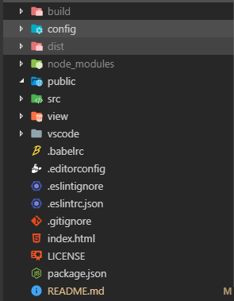

# webpack-simple-framework

webpack-simple-framework 一个基于 webpack 构建的脚手架工具，用于对 JS 框架进行打包处理使用，**面向轮子打包使用，非直接构建 web 应用**。

 

 

 

### webpack-simple-framework 与 vue-cli 的差异：

> 1. webpack-simple-framework 相较于 vue-cli 比较简单，没有太过复杂的框架配置，方便上手与对脚手架的修改
> 2. webpack-simple-framework 将演示的代码与最后打包出来的代码分离出来，而且 vue-cli 只针对项目代码，也即是 vue-cli 开发和生产模式下打包的代码是一样的。
> 3. webpack-simple-framework 支持命令行发布代码到 npm 上（实现中）:worried:
> 4. webpack-simple-framework 支持对 eslint 一键自动修复代码编码风格
> 5. 未来支持 vue 和 react(虽然目前只支持 vue) :worried:

 

 

### 安装运行方法

> git clone https://github.com/leslieSie/webpack-simple-framework.git
>
> yarn install (推荐) || npm install
>
> yarn dev || npm run dev

 

 

 

### scripts 的用法

**dev** : 用来开启开发模式，自动运行开发服务器，默认网址：http:localhost:8888

可以通过在 config 文件夹下面的 dev.config.js 文件去做修改。

**build** : 用于对要编写的框架进行打包成最终发布效果的,生成的地址在 build 文件夹下面

**lint** : 用于对代码进行 eslint 的检测和修复，相当执行 lint:dev 和 lint:prod 两条命令

**lint:dev** : 对 view 目录下面的代码进行风格检测修复

**lint:prod** : 对 src 目录下面的代码进行风格化修复

 

 

 

##### 目录结构说明

**build 目录** : 用于存放最终打包发布的文件目录，一般在这个文件目录进行修改，如果安装之后没有 build 文件的话，执行 yarn build 就会自动生成产生。

**config 目录** : 存放 webpack 打包配置文件

**dist 目录** : dev server 的指向目录，用于开发模式下面的调试，不在上面进行修改

**public 目录** : 存放公共的资源文件，一般存放图片等静态资源

**src 目录** : 最终要打包的框架的源码

**view 目录** : 开发模式对应测试代码存放的目录，区别于**src 目录**,view 目录执行 yarn build 的情况下，不会对 view 目录下面的代码进行打包，该目录下面的代码仅用于在开发模式下的调试使用。

 

 

 

##### 项目贡献者

<a href="https://github.com/fengxianqi" target="_blank">

​	

</a>

 

 

 

### 扶持作者

开源不易，一分钱也是钱，希望得到各位大佬们的支持，你的支持是我前进的动力。

